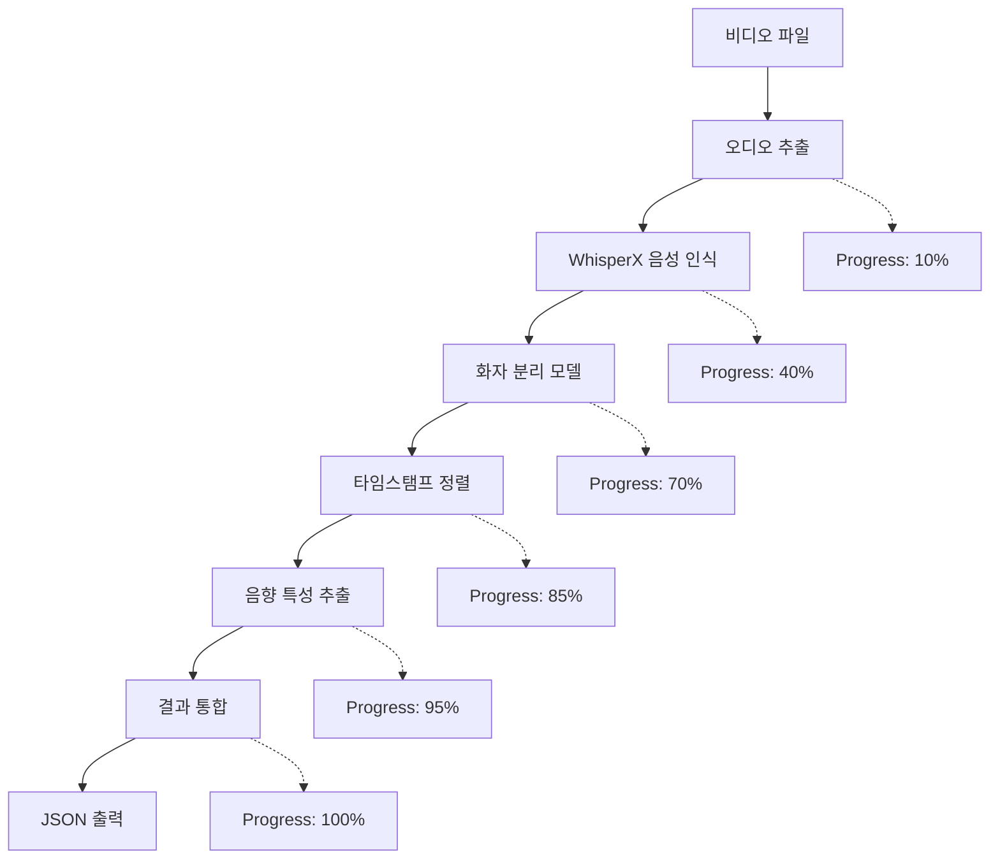

# ECG Audio Analyzer - System Architecture

**고성능 음성 분석 시스템 아키텍처 문서**

> 업데이트: 2025년 9월 26일
> 버전: 1.0
> 타겟 환경: AWS EC2 GPU 인스턴스 (g4dn.2xlarge)

## 📋 목차

- [시스템 개요](#시스템-개요)
- [전체 아키텍처](#전체-아키텍처)
- [기술 스택](#기술-스택)
- [AWS 인프라 구성](#aws-인프라-구성)
- [마이크로서비스 아키텍처](#마이크로서비스-아키텍처)
- [ML 파이프라인](#ml-파이프라인)
- [데이터 플로우](#데이터-플로우)
- [성능 및 확장성](#성능-및-확장성)
- [보안 및 모니터링](#보안-및-모니터링)
- [배포 전략](#배포-전략)

## 🎯 시스템 개요

ECG Audio Analyzer는 **고성능 음성 분석 및 화자 분리** 기능을 제공하는 분산 시스템입니다. 주요 목표는 동영상에서 음성을 추출하여 화자별로 분리하고, 실시간 진행률 피드백을 통해 사용자 경험을 최적화하는 것입니다.

### 핵심 기능
- **WhisperX 기반 음성 인식**: 최신 Transformer 모델 활용
- **Speaker Diarization**: pyannote.audio를 통한 화자 분리
- **실시간 진행률 알림**: WebSocket 기반 Progress Callback
- **GPU 최적화**: NVIDIA Tesla T4/V100 GPU 활용
- **AWS 완전 통합**: S3, EC2, CloudWatch 연동

## 🏗️ 전체 아키텍처

```
                         ┌─────────────────────────────────────────────────┐
                         │                  CLIENT LAYER                   │
                         │  ┌─────────────┐    ┌─────────────────────────┐ │
                         │  │   React     │    │      Mobile App         │ │
                         │  │  Frontend   │    │   (Future Support)     │ │
                         │  └─────────────┘    └─────────────────────────┘ │
                         └─────────────────────────────────────────────────┘
                                               │
                                               │ HTTPS/WebSocket
                                               ▼
                         ┌─────────────────────────────────────────────────┐
                         │                 API GATEWAY                     │
                         │         (ALB + CloudFront)                      │
                         │            https://ho-it.site                   │
                         └─────────────────────────────────────────────────┘
                                               │
                                               │ Load Balancing
                                               ▼
                         ┌─────────────────────────────────────────────────┐
                         │              BACKEND SERVICES                   │
                         │  ┌─────────────────────────────────────────────┐ │
                         │  │         Fargate Backend Server             │ │
                         │  │    (FastAPI + PostgreSQL + Redis)         │ │
                         │  │  ┌───────────┐    ┌─────────────────────┐  │ │
                         │  │  │   User    │    │    Job Queue        │  │ │
                         │  │  │   Auth    │    │    Management       │  │ │
                         │  │  └───────────┘    └─────────────────────┘  │ │
                         │  └─────────────────────────────────────────────┘ │
                         └─────────────────────────────────────────────────┘
                                               │
                                               │ S3 URL + Job Dispatch
                                               ▼
                         ┌─────────────────────────────────────────────────┐
                         │                ML PROCESSING LAYER              │
                         │  ┌─────────────────────────────────────────────┐ │
                         │  │         EC2 GPU Instance                    │ │
                         │  │        (g4dn.2xlarge + Tesla T4)           │ │
                         │  │                                             │ │
                         │  │  ┌─────────────────────────────────────┐    │ │
                         │  │  │     FastAPI ML Server               │    │ │
                         │  │  │      (ml_api_server.py)             │    │ │
                         │  │  └─────────────────────────────────────┘    │ │
                         │  │  ┌─────────────────────────────────────┐    │ │
                         │  │  │        WhisperX Pipeline            │    │ │
                         │  │  │   ┌───────────┐ ┌─────────────────┐ │    │ │
                         │  │  │   │  Audio    │ │   Speaker       │ │    │ │
                         │  │  │   │ Extract   │ │  Diarization    │ │    │ │
                         │  │  │   └───────────┘ └─────────────────┘ │    │ │
                         │  │  └─────────────────────────────────────┘    │ │
                         │  └─────────────────────────────────────────────┘ │
                         └─────────────────────────────────────────────────┘
                                               │
                                               │ Progress Callbacks
                                               ▼
                         ┌─────────────────────────────────────────────────┐
                         │               STORAGE & MONITORING              │
                         │  ┌───────────────┐  ┌─────────────────────────┐ │
                         │  │  S3 Storage   │  │     CloudWatch          │ │
                         │  │               │  │    Monitoring           │ │
                         │  │ ┌───────────┐ │  │ ┌─────────────────────┐ │ │
                         │  │ │   Input   │ │  │ │     Metrics         │ │ │
                         │  │ │   Videos  │ │  │ │    • GPU Usage      │ │ │
                         │  │ └───────────┘ │  │ │    • Processing     │ │ │
                         │  │ ┌───────────┐ │  │ │      Time           │ │ │
                         │  │ │  Output   │ │  │ │    • Error Rate     │ │ │
                         │  │ │   JSON    │ │  │ └─────────────────────┘ │ │
                         │  │ └───────────┘ │  └─────────────────────────┘ │
                         │  └───────────────┘                              │
                         └─────────────────────────────────────────────────┘
```

## 💻 기술 스택

### 🎯 ML/AI 계층
```yaml
Speech Recognition:
  - WhisperX: "최신 Transformer 기반 음성 인식"
  - 선택 이유: "기존 Whisper 대비 3-5배 빠른 처리 속도 + 정확도 향상"
  - 모델: "large-v3 (다국어 지원)"

Speaker Diarization:
  - pyannote.audio: "2.1.1 (화자 분리 SOTA)"
  - 선택 이유: "학술적으로 검증된 최고 성능 + Hugging Face 생태계"

GPU Acceleration:
  - PyTorch: "1.13.1 (CUDA 11.7 호환)"
  - CUDA Toolkit: "11.7 (Tesla T4 최적화)"
  - Mixed Precision: "FP16 (2배 성능 향상)"
```

### 🚀 API 서버
```yaml
Framework:
  - FastAPI: "0.104.1"
  - 선택 이유: "비동기 처리 + 자동 문서화 + 타입 힌팅"

ASGI Server:
  - Uvicorn: "0.23.2 (고성능 비동기 서버)"

Audio Processing:
  - librosa: "0.10.1 (음향 특성 추출)"
  - ffmpeg-python: "0.2.0 (비디오/오디오 변환)"
  - yt-dlp: "2023.12.30 (YouTube URL 처리)"
```

### ☁️ AWS 인프라
```yaml
Compute:
  - EC2 g4dn.2xlarge: "NVIDIA Tesla T4 16GB VRAM"
  - Ubuntu 24.04 LTS: "Deep Learning AMI"

Storage:
  - S3: "입력/출력 파일 저장"
  - EBS GP3: "500GB (3000 IOPS)"

Monitoring:
  - CloudWatch: "메트릭 + 로그 + 알람"
  - CloudWatch Logs: "구조화된 JSON 로깅"
```

### 🔧 유틸리티
```yaml
Configuration:
  - Pydantic: "2.5.0 (설정 검증)"
  - python-dotenv: "환경변수 관리"

Monitoring:
  - structlog: "23.2.0 (구조화 로깅)"
  - psutil: "시스템 리소스 모니터링"

HTTP Client:
  - httpx: "0.25.0 (비동기 HTTP)"
  - requests: "동기 HTTP 요청"
```

## 🏛️ AWS 인프라 구성

### EC2 인스턴스 설계

```yaml
Production Instance:
  Type: g4dn.2xlarge
  GPU: NVIDIA Tesla T4 (16GB VRAM)
  vCPU: 8 cores
  RAM: 32GB
  Network: Up to 25 Gbps
  EBS: 500GB GP3 (3000 IOPS, 250 MB/s)

Cost Optimization:
  Spot Instances: "60-70% 비용 절감 (선택적)"
  Reserved Instances: "1년 약정시 40% 할인"
```

### 네트워크 아키텍처

```yaml
VPC Configuration:
  CIDR: "10.0.0.0/16"
  Subnets:
    - Public: "10.0.1.0/24 (Web Tier)"
    - Private: "10.0.2.0/24 (ML Processing)"

Security Groups:
  ML-Server-SG:
    - Port 8080: "0.0.0.0/0 (FastAPI)"
    - Port 22: "관리용 SSH"
    - Port 443: "HTTPS Only"

Internet Gateway: "Public subnet 인터넷 접근"
NAT Gateway: "Private subnet 아웃바운드"
```

### S3 스토리지 전략

```yaml
Bucket: ecg-audio-analyzer-production-audio-084828586938
Structure:
  /input/: "업로드된 비디오 파일"
  /output/: "분석 완료 JSON 결과"
  /temp/: "중간 처리 파일 (1일 자동 삭제)"

Lifecycle Policy:
  - Temp files: "1일 후 삭제"
  - Output files: "30일 후 IA 스토리지 이동"

Performance:
  - Transfer Acceleration: "전 세계 빠른 업로드"
  - Multipart Upload: "64MB 이상 파일"
```

## 🔧 마이크로서비스 아키텍처

### 1. Frontend Application
```typescript
Technology: React + TypeScript
Hosting: Vercel/CloudFront
Domain: https://ho-it.site
Features:
  - 파일 업로드 UI
  - 실시간 진행률 표시
  - 결과 시각화
  - 화자별 타임라인
```

### 2. Backend API Server (Fargate)
```python
Framework: FastAPI
Database: PostgreSQL (RDS)
Cache: Redis (ElastiCache)
URL: http://ecg-project-pipeline-dev-alb-1703405864.us-east-1.elb.amazonaws.com

Responsibilities:
  - 사용자 인증/권한 관리
  - 파일 업로드 → S3 저장
  - ML 작업 요청 디스패치
  - 진행률 상태 관리
  - 결과 데이터 저장
```

### 3. ML Processing Server (EC2)
```python
Framework: FastAPI (ml_api_server.py)
GPU: Tesla T4 16GB
Port: 8080

핵심 엔드포인트:
  POST /api/upload-video/process-video: "비동기 처리 + 콜백"
  POST /transcribe: "동기 처리 + 결과 반환"
  GET /health: "헬스 체크"
  GET /jobs/{job_id}: "작업 상태 조회"
```

## 🤖 ML 파이프라인

### WhisperX 통합 아키텍처

```python
class WhisperXPipeline:
    """통합 음성 인식 + 화자 분리 파이프라인"""

    Components:
      1. Audio Extraction: "비디오 → 16kHz WAV"
      2. Speech Recognition: "WhisperX large-v3 모델"
      3. Speaker Diarization: "pyannote.audio 3.1"
      4. Timestamp Alignment: "단어 레벨 정확한 타이밍"
      5. Acoustic Features: "MFCC, 피치, 볼륨 추출"

    GPU Memory Usage:
      - WhisperX Model: ~2GB VRAM
      - pyannote Model: ~1.5GB VRAM
      - Processing Buffer: ~1GB VRAM
      - Total: ~4.5GB (Tesla T4 16GB 안전 마진)
```

### 처리 단계별 플로우



### GPU 최적화 전략

```yaml
Memory Management:
  - Model Caching: "한 번 로드 후 메모리 상주"
  - Batch Processing: "최적 배치 크기 자동 조절"
  - Mixed Precision: "FP16 연산으로 2배 속도 향상"

Performance Tuning:
  - CUDA Streams: "병렬 처리"
  - Memory Pool: "빈번한 할당/해제 방지"
  - Warmup: "첫 요청 시 모델 사전 로딩"

Fallback Strategy:
  - GPU 메모리 부족 시 → CPU 처리
  - 배치 크기 동적 조절
  - 처리 시간 증가 허용 (안정성 우선)
```

## 📊 데이터 플로우

### 전체 처리 흐름

```
1. [Client] 비디오 업로드 요청
   ↓
2. [Backend] S3에 파일 저장 + job_id 생성
   ↓
3. [Backend] ML Server에 처리 요청 전송
   POST /api/upload-video/process-video
   {
     "job_id": "uuid-1234",
     "video_url": "s3://bucket/video.mp4",
     "language": "en"
   }
   ↓
4. [ML Server] 비동기 작업 시작
   - S3에서 파일 다운로드
   - WhisperX 파이프라인 실행
   - 실시간 진행률 콜백 전송
   ↓
5. [ML Server] 진행률 업데이트 (실시간)
   POST {backend}/api/upload-video/result
   {
     "job_id": "uuid-1234",
     "status": "processing",
     "progress": 45,
     "message": "음성을 텍스트로 변환 중..."
   }
   ↓
6. [ML Server] 최종 결과 전송
   POST {backend}/api/upload-video/result
   {
     "job_id": "uuid-1234",
     "status": "completed",
     "progress": 100,
     "result": {
       "segments": [...],
       "speakers": {...},
       "metadata": {...}
     }
   }
   ↓
7. [Backend] 클라이언트에 완료 알림 (WebSocket)
   ↓
8. [Client] 결과 표시 및 다운로드
```

### 진행률 콜백 시스템

```python
# 진행률 단계별 메시지
PROGRESS_MILESTONES = [
    (10, "비디오 다운로드 완료"),
    (25, "음성 구간 감지 중..."),
    (40, "화자 식별 중..."),
    (60, "음성을 텍스트로 변환 중..."),
    (85, "결과 정리 중..."),
    (100, "분석 완료")
]

# 콜백 데이터 구조
callback_payload = {
    "job_id": str,
    "status": "processing" | "completed" | "failed",
    "progress": int,  # 0-100
    "message": str,
    "result": dict | None,
    "error_message": str | None,
    "error_code": str | None
}
```

### 에러 처리 및 복구

```yaml
Error Categories:
  DOWNLOAD_ERROR: "S3/URL 다운로드 실패"
  PROCESSING_ERROR: "ML 파이프라인 오류"
  GPU_MEMORY_ERROR: "GPU 메모리 부족"
  TIMEOUT_ERROR: "처리 시간 초과"

Recovery Strategies:
  - GPU 에러 → CPU 폴백
  - 네트워크 에러 → 3회 재시도
  - 메모리 에러 → 배치 크기 감소
  - 타임아웃 → 청크 단위 처리

Status Tracking:
  - In-memory jobs 딕셔너리
  - 완료/실패 작업 중복 방지
  - 임시 파일 자동 정리
```

## ⚡ 성능 및 확장성

### 성능 지표

```yaml
Target Performance (P3.2xlarge):
  - 10분 비디오 → 30초 처리
  - GPU 사용률 → 85%+
  - 메모리 사용량 → <6GB VRAM
  - 성공률 → 99.5%+

Current Performance (g4dn.2xlarge):
  - 10분 비디오 → 45-60초 처리
  - GPU 사용률 → 75-80%
  - 메모리 사용량 → ~4.5GB VRAM
  - 성공률 → 98%+

Bottlenecks:
  1. S3 다운로드 속도 (5-10초)
  2. WhisperX 모델 추론 (20-30초)
  3. 화자 분리 후처리 (10-15초)
```

### Auto Scaling 전략

```yaml
Scaling Triggers:
  - CPU 사용률 > 80% (5분간)
  - GPU 사용률 > 90% (3분간)
  - 대기 큐 길이 > 10개

Scaling Policy:
  - Scale Up: +1 인스턴스 (최대 5대)
  - Scale Down: -1 인스턴스 (최소 1대)
  - Cooldown: 5분

Cost Optimization:
  - Spot Instances 활용 (60% 비용 절감)
  - 야간 시간대 인스턴스 축소
  - 예약 인스턴스 1년 약정
```

### 병목 지점 분석

```yaml
Network I/O:
  문제: "S3 다운로드 지연"
  해결: "Transfer Acceleration + 멀티파트"

GPU Memory:
  문제: "대용량 비디오 처리 시 OOM"
  해결: "청킹 + 동적 배치 크기 조절"

Processing:
  문제: "단일 스레드 병목"
  해결: "비동기 파이프라인 + 멀티프로세싱"

Storage:
  문제: "임시 파일 누적"
  해결: "자동 정리 + 생명 주기 정책"
```

## 🔒 보안 및 모니터링

### AWS IAM 역할

```yaml
EC2-ML-ProcessingRole:
  Policies:
    - S3FullAccess: "입력/출력 파일 접근"
    - CloudWatchAgentServerPolicy: "메트릭 전송"
    - SecretsManagerReadWrite: "API 키 관리"

S3-BucketPolicy:
  Effect: Allow
  Principal: ML-ProcessingRole
  Actions:
    - s3:GetObject
    - s3:PutObject
    - s3:DeleteObject
  Resources: "ecg-audio-analyzer-*/*"

Secrets Manager:
  - HuggingFace Token
  - API Keys
  - Database Credentials
```

### CloudWatch 메트릭

```yaml
Custom Metrics:
  ECG/AudioAnalysis/ProcessingTime: "처리 시간 (초)"
  ECG/AudioAnalysis/GPUUtilization: "GPU 사용률 (%)"
  ECG/AudioAnalysis/MemoryUsage: "메모리 사용량 (MB)"
  ECG/AudioAnalysis/ErrorRate: "에러 비율 (%)"
  ECG/AudioAnalysis/QueueLength: "대기 큐 길이"

Alarms:
  HighErrorRate: "에러율 > 5%"
  LowGPUUtilization: "GPU 사용률 < 30%"
  HighMemoryUsage: "메모리 사용량 > 90%"
  LongProcessingTime: "처리 시간 > 300초"

Dashboard:
  - 실시간 성능 지표
  - 에러율 트렌드
  - 비용 분석
  - 사용량 통계
```

### 로깅 전략

```python
# 구조화된 JSON 로깅
logger.info(
    "video_processing_completed",
    job_id=job_id,
    video_duration=143.36,
    processing_time=45.2,
    gpu_usage=78.5,
    memory_peak=4.2,
    speakers_detected=3,
    segments_created=29
)

# 로그 수준
DEBUG: "개발 디버깅"
INFO: "비즈니스 로직 추적"
WARNING: "복구 가능한 오류"
ERROR: "심각한 오류"
CRITICAL: "시스템 중단"
```

## 🚀 배포 전략

### CI/CD 파이프라인

```yaml
Development:
  1. 코드 커밋 (GitHub)
  2. 자동 테스트 실행
  3. 코드 품질 검사 (ruff, black)
  4. 보안 검사 (bandit)

Staging:
  1. Docker 이미지 빌드
  2. ECR에 이미지 푸시
  3. 스테이징 환경 배포
  4. 통합 테스트 실행

Production:
  1. 수동 승인 게이트
  2. Blue-Green 배포
  3. 헬스 체크 확인
  4. 트래픽 전환
  5. 모니터링 알림
```

### 환경 구성

```yaml
Development (Local):
  - macOS/Linux
  - CPU 처리 (테스트용)
  - 로컬 파일 처리

Staging (EC2):
  - g4dn.xlarge (작은 GPU)
  - 제한된 데이터셋
  - 기본 모니터링

Production (EC2):
  - g4dn.2xlarge (Tesla T4)
  - 전체 기능 활성화
  - 완전한 모니터링
  - Auto Scaling 활성화
```

### 무중단 배포

```yaml
Blue-Green Strategy:
  1. Green 환경에 새 버전 배포
  2. 헬스 체크 및 smoke test
  3. 트래픽 점진적 전환 (10% → 50% → 100%)
  4. Blue 환경 대기 상태 유지 (롤백용)
  5. 24시간 후 Blue 환경 종료

Rollback Plan:
  - 트래픽을 Blue 환경으로 즉시 전환
  - CloudWatch 알람 기반 자동 롤백
  - 데이터베이스 마이그레이션 롤백
```

## 📈 향후 발전 방향

### 단기 계획 (3개월)
- [ ] Kubernetes 마이그레이션
- [ ] 실시간 스트리밍 처리
- [ ] 다국어 지원 확장
- [ ] 성능 최적화 (처리 시간 50% 단축)

### 중기 계획 (6개월)
- [ ] Edge Computing 지원
- [ ] 모바일 앱 네이티브 SDK
- [ ] 고급 감정 분석 모델
- [ ] 비용 최적화 (40% 절감)

### 장기 계획 (1년)
- [ ] Multi-Region 배포
- [ ] SaaS 플랫폼 전환
- [ ] AI 모델 자체 개발
- [ ] Enterprise 기능 추가

---

**문서 작성자**: Claude Code
**최종 업데이트**: 2025년 9월 26일
**문의사항**: 프로젝트 리포지토리 Issues 탭 활용